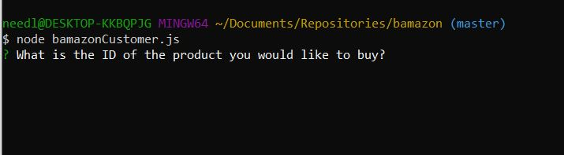
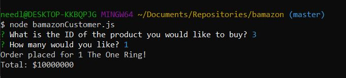
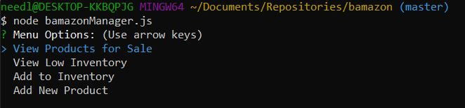
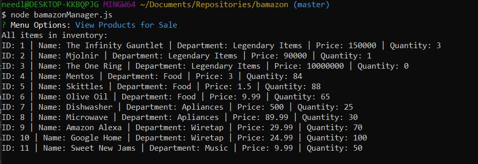
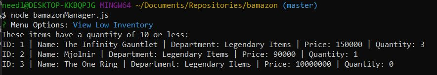
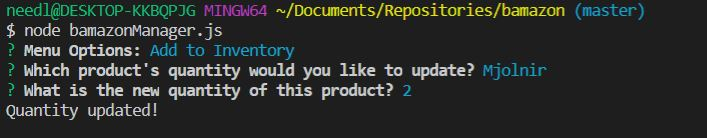
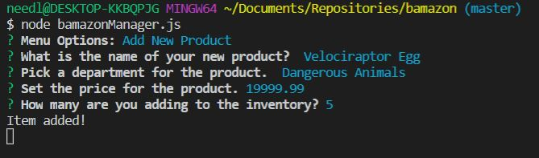
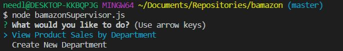

# Bamazon Node App
This is an Amazon-like application where a user can place orders, manage inventory, and view the profits of sales.
- - -
# Bamazon Customer App

In the Customer app (bamazonCustomer.js) the user may place an order by selecting a specific ID for a product they would like to purchase.

* Upon starting the app the customer will be asked to specify by ID which product they wouldlike to buy, as well as the quantity

* After spefifying the ID and quantity, the customer will be given a confirmation message and total for their purchase

- - -
# Bamazon Manager App

The manager app (bamazonManager.js) is able to manage the inventory of the store

* Opening the app will initiate the menu, listing their options:
    - View all products for sale
    - View products with low inventory
    - Add to inventory
    - Add a new product

## View All Products For Sale

This option will show all products with all their information

## View Low Inventory

This option will filter out all items with an inventory less than 10

## Add To Inventory

This option will allow the manager to add a new quantity to a product slected by name

## Add a New Product

This option allows the manager to create a new item, specifying the name, department, price, and quantity

- - -

# Bamazon Supervisor App

This app is still under development.
When it is finished, it will enable a supervisor at Bamazon to calculate the total profits from any of the departments in the Bamazon database, as well as creating entirely new departments.

